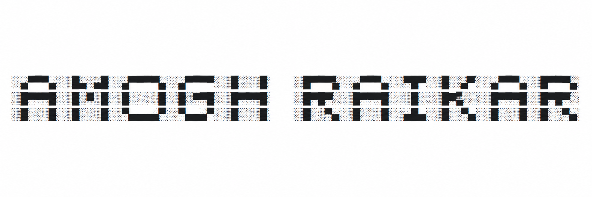

<!-- ===================================================== -->
<!--                 ANIMATED INTRO SECTION                -->
<!-- ===================================================== -->
<!-- 🔥 ASCII LOGO -->

  

 
  

  <strong>BCA @ BMSCCM'27</strong> • 
  <strong>Aspiring POLYMATH</strong> • 
  <strong>Cybersecurity Enthusiast</strong>

  I build software, design digital experiences, and explore technologies across the computing spectrum.
Passionate about software engineering, cybersecurity, AI, systems, and solving real-world problems.

---

##  Tech Arsenal

| Category        | Tools & Technologies |
|-----------------|----------------------|
| **Programming** |    |
| **AI / ML**      |       |
| **Design & Tools** |   |

---

##  Projects & Work

Here are some of the repositories / projects I’ve built and worked on 👇  

| Project | Description |
|--------|-------------|
| **<a href="https://github.com/amoghraikar/SentinelAI">SentinelAI</a>** | A next-generation authentication platform leveraging computer vision, speaker verification, and AI-driven risk analysis to provide adaptive multi-factor authentication. |
| **<a href="https://github.com/amoghraikar">coming soon</a>** | A safety system built using Arduino UNO that automatically detects and counts children entering and exiting a school bus using ultrasonic sensors. If any child is left behind when the engine is turned off, the system triggers buzzer and LED alerts.  |
| **<a href="https://github.com/amoghraikar">coming soon</a>** |A real-time Face Emotion Detection system that captures live webcam video, detects faces, and predicts the dominant emotion (Happy, Sad, Angry, Surprise, Neutral, etc.) using Deep Learning. Fully optimized for Apple Silicon (M1 / M2 / M3 / M4) macOS devices.|

---

##  Open-Source Contributions

⭐ Actively contributing to Cybersecurity, Embedded Systems, Data Analysis , Software Development and  Automation projects.   
⭐ More coming soon as I expand my computer science journey!

---

##  GitHub Stats & Achievements

<table>
<tr>
<td>

###  GitHub Stats  

</td>
<td>

###  Streaks  

</td>
</tr>

<tr>
<td colspan="2" align="center">

###  Achievements  

</td>
</tr>
</table>

---

##  Contact Me

---

  ✨ *Always learning. Always building. Always exploring AI.* ✨  

